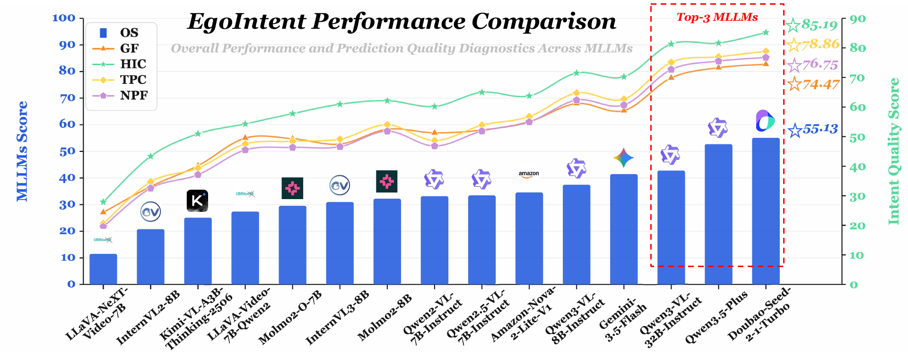
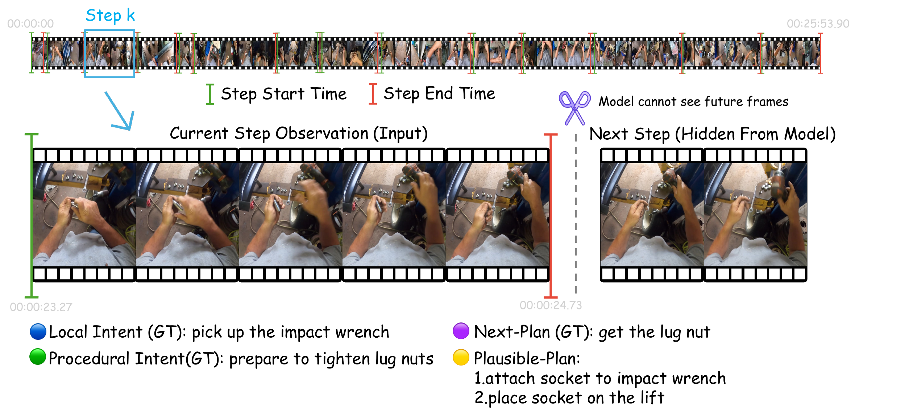

<div align="center">
  

# EgoIntent: A Pre-Outcome Micro-Step Benchmark for Understanding What, Why, and Next

[](https://huggingface.co/datasets/py2279105943/EgoIntent)
[](paper/EgoIntent.pdf)
[](#benchmark-overview)

</div>

Official repository for **EgoIntent**, a benchmark for inferring fine-grained human intent from egocentric procedural videos *before* the current outcome becomes visible.

## 🖼️ Teaser Figure

<p align="center">
  
</p>

## 🚀 News

- **[2026-08]** The EgoIntent dataset and project repository are publicly available.

---

## 🌟 Highlights

- **Pre-outcome reasoning:** Every observation ends before the step's key outcome is visually revealed, preventing retrospective recognition from replacing intent inference.
- **What–Why–Next formulation:** Each micro-step is annotated with **Local Intent** (What), **Procedural Intent** (Why), and **Next-Plan** (Next).
- **Fine-grained human annotation:** EgoIntent contains **3,014 manually constructed micro-steps** from **32 egocentric videos** across **15 indoor and outdoor scenarios**.
- **Comprehensive evaluation:** We evaluate **15 MLLMs** with reference-based accuracy and complementary reference-free diagnostics.
- **Shortcut diagnostics:** Controlled studies test temporal order, motion, context length, visual evidence, and outcome/future leakage.

---

## Benchmark Overview

Given a pre-outcome egocentric video clip, a model predicts three open-ended labels:

| Dimension | Question | Definition |
|---|---|---|
| **Local Intent** | What? | The actor's immediate goal in the current micro-step. |
| **Procedural Intent** | Why? | The functional role of the current step in the broader procedure. |
| **Next-Plan** | Next? | The action most likely to occur immediately after the observation boundary. |

The model receives no activity name, scene label, narration, answer option, reference annotation, or future frame.

### Method Figure

<p align="center">
  
</p>

## 📦 Dataset

The complete dataset is hosted on Hugging Face:

### [🤗 py2279105943/EgoIntent](https://huggingface.co/datasets/py2279105943/EgoIntent)

Download it with the Hugging Face CLI:

```bash
huggingface-cli download \
  --repo-type dataset \
  py2279105943/EgoIntent \
  --local-dir ./data/EgoIntent
```

Or with Python:

```python
from huggingface_hub import snapshot_download

snapshot_download(
    repo_id="py2279105943/EgoIntent",
    repo_type="dataset",
    local_dir="./data/EgoIntent",
)
```

Please consult the [Hugging Face dataset card](https://huggingface.co/datasets/py2279105943/EgoIntent) for the latest file organization, access conditions, and usage terms. The source videos originate from Ego4D; users must also comply with the applicable Ego4D licenses and terms.

---

## Quick Start

Use the released prompts in [`prompts/`](prompts/) with one complete observation-window video. A prediction must contain exactly three English verb phrases:

```json
{
  "local_intent": "place the sliced vegetables into the bowl",
  "procedural_intent": "prepare the ingredients for mixing",
  "next_step": "add the dressing to the bowl"
}
```

The prompt package contains:

- [`benchmark_prediction_system.txt`](prompts/benchmark_prediction_system.txt): task definitions, evidence rules, and output constraints.
- [`benchmark_prediction_user.txt`](prompts/benchmark_prediction_user.txt): user message paired with the video.

## 📊 Main Results

Reference-based scores measure semantic agreement with human annotations on the complete benchmark. **Overall** is the mean of Local, Procedural, and Next.

| Model | Local | Procedural | Next | Overall |
|---|---:|---:|---:|---:|
| **Doubao-Seed-2.1-Turbo** | 57.98 | 63.62 | 43.78 | **55.13** |
| Qwen3.5-Plus | 57.99 | 57.76 | 42.38 | 52.71 |
| Gemini-3.5-Flash | 43.34 | 48.31 | 32.72 | 41.45 |
| Amazon-Nova-2-Lite-V1 | 37.98 | 42.96 | 22.84 | 34.59 |
| **Qwen3-VL-32B-Instruct** | 45.14 | 52.81 | 30.44 | **42.80** |
| Qwen3-VL-8B-Instruct | 40.86 | 45.03 | 26.59 | 37.49 |
| Qwen2.5-VL-7B-Instruct | 35.41 | 42.45 | 22.53 | 33.46 |
| Qwen2-VL-7B-Instruct | 37.42 | 39.57 | 22.53 | 33.18 |
| Molmo2-8B | 35.10 | 41.01 | 20.55 | 32.22 |
| InternVL3-8B | 34.25 | 40.16 | 18.51 | 30.97 |
| Molmo2-O-7B | 32.36 | 37.32 | 19.02 | 29.57 |
| LLaVA-Video-7B-Qwen2 | 33.14 | 33.42 | 15.65 | 27.41 |
| Kimi-VL-A3B-Thinking-2506 | 27.11 | 33.19 | 14.98 | 25.09 |
| InternVL2-8B | 21.60 | 28.25 | 12.58 | 20.81 |
| LLaVA-NeXT-Video-7B | 13.36 | 15.51 | 5.76 | 11.54 |

The best closed-source model reaches 55.13 Overall; the strongest open-weight model reaches 42.80. Next-Plan is the most difficult dimension for every evaluated model.

See [`results/leaderboard.md`](results/leaderboard.md) for the complete reference-free diagnostic scores.

---

## Repository Structure

```text
EgoIntent/
├── assets/                  # README figures and project branding
├── paper/EgoIntent.pdf      # Anonymous paper manuscript
├── prompts/                 # Official benchmark prediction prompts
├── results/leaderboard.md   # Full benchmark results
└── README.md
```

## 💬 Citation

If you find EgoIntent useful, please cite the paper. The final BibTeX entry will be added after publication.

## Acknowledgements

EgoIntent is constructed from Ego4D source videos. We thank the Ego4D team and the benchmark annotators and reviewers.
